# Bockly2Java Local Dependencies
A graphics library for [Blockly2Java](https://github.com/ValentinHerrmann/Bockly2Java) (or the base project [OnlineIDE](https://github.com/martin-pabst/Online-IDE-new-compiler)) projects, providing local execution support when online environment dependencies aren't available.
## Purpose
This project serves as a bridge for Blockly2Java applications that need to run locally without relying on OnlineIDE's online environment dependencies. It provides the necessary components to execute Blockly2Java code in a local development environment.
## Getting started
Add the following dependency to you `pom.xml`
```
<dependency>
    <groupId>de.blockly2java</groupId>
    <artifactId>graphics</artifactId>
    <version>[0.1.0,)</version> <!-- e.g. any version newer than 0.1.0 -->
</dependency>
```
## UML
### Class Diagram

```mermaid
classDiagram
    %% Hide private and protected members
    hide emptyMembers
    class Shape {
        <<Abstract>>
        + Shape setFillColor(Color color)
        + Shape setFillColor(Color color, double alpha)
        + Shape setFillColor(int color)
        + Shape setFillColor(int color, double alpha)
        + Shape setFillColor(String color)
        + Shape setFillColor(String color, double alpha)
        + Color getFillColor()
        + int getFillColorAsInt()
        + Shape setBorderColor(Color color)
        + Shape setBorderColor(Color color, double alpha)
        + Shape setBorderColor(int color)
        + Shape setBorderColor(int color, double alpha)
        + Shape setBorderColor(String color)
        + Shape setBorderColor(String color, double alpha)
        + Color getBorderColor()
        + int getBorderColorAsInt()
        + Shape setBorderWidth(double width)
        + double getBorderWidth()
        + Shape setAlpha(double alpha)
        + double getAlpha()
        + static void setDefaultVisibility(boolean visible)
        + Shape setVisible(boolean visible)
        + boolean isVisible()
        + Shape setStatic(boolean isStatic)
        + boolean isStatic()
        + Shape bringToFront()
        + Shape sendToBack()
        + double getCenterX()
        + double getCenterY()
        + Shape move(double dx, double dy)
        + Shape moveTo(double x, double y)
        + Shape setX(double x)
        + Shape setY(double y)
        + Shape rotate(double angleDeg)
        + Shape rotate(double angleDeg, double pivotX, double pivotY)
        + Shape scale(double factor)
        + Shape setScale(double newScale)
        + Shape scale(double factor, double pivotX, double pivotY)
        + Shape mirrorX()
        + Shape mirrorY()
        + Shape defineDirection(double angleDeg)
        + Shape forward(double distance)
        + double getAngle()
        + Shape setAngle(double newAngle)
        + boolean containsPoint(double x, double y)
        + boolean isOutsideView()
        + Shape tint(int color)
        + Shape tint(String color)
        + Shape tint(Color color)
        + Direction directionRelativeTo(Shape other)
        + Shape moveBackFrom(Shape other, boolean keepColliding)
        + boolean collidesWith(Shape other)
        + boolean collidesWithAnyShape()
        + Shape getFirstCollidingShape()
        + List<Shape> getCollidingShapes(Group<? extends Shape> group)
        + World getWorld()
        + void destroy()
        + Shape defineCenter(double x, double y)
        + Shape defineCenterRelative(double relX, double relY)
        # Bounds getBounds()
        # List<Point> getLocalPoints()
        # List<Point> getTransformedPoints()
        # Point transformPoint(Point local)
        # Point inverseTransformPoint(double x, double y)
        # static double clampAlpha(double value)
        # static double normalizeAngle(double angle)
    }
    class Group {
        + Group()
        + Group(Shape... shapes)
        + void add(Shape shape)
        + void add(Shape... shapes)
        + void remove(Shape shape)
        + void remove(int index)
        + T get(int index)
        + int indexOf(Shape shape)
        + int size()
        + void empty()
        + void destroyAllChildren()
        + Group<T> copy()
        + Shape move(double dx, double dy)
        + boolean containsPoint(double x, double y)
        + boolean collidesWith(Shape other)
        + List<Shape> getCollidingShapes(Shape other)
        + List<Shape> getChildren()
        # Bounds getBounds()
        void bringChildToFront(Shape child)
        void sendChildToBack(Shape child)
        - boolean containsRecursively(Shape shape)
        - void addInternal(Shape shape)
        - void updateCenterFromChildren()
        + String toString() 
    }
    class World {
        + World()
        + World(double width, double height)
        + static World getWorld()
        + static void clear()
        void registerShape(Shape shape) 
        void unregisterFromDefaultList(Shape shape) 
        void deregisterShape(Shape shape) 
        void bringToFront(Shape shape) 
        void sendToBack(Shape shape)
        + double getWidth()
        + double getHeight()
        + double getTop()
        + double getLeft()
        + Group<? extends Shape> getDefaultGroup()
        + void setDefaultGroup(Group<? extends Shape> defaultGroup)
        + void setBackgroundColor(Color color)
        + void setBackgroundColor(int color)
        + void setBackgroundColor(String color)
        + Color getBackgroundColor()
        + void move(double dx, double dy)
        + void rotate(double angleInDeg, double centerX, double centerY)
        + void scale(double factor, double centerX, double centerY)
        + void flipY()
        + void setCoordinateSystem(double left, double top, double width, double height)
        + void setCursor(String cursor)
        + void follow(Shape shape, double margin, double xMin, double xMax, double yMin, double yMax)
        + void addMouseListener(Object mouseListener)
        + List<Shape> getAllShapes()
        - void collectShapes(Shape shape, List<Shape> target)
        + List<Shape> getRootShapes()
    }
    class Circle {
        + Circle()
        + Circle(double x, double y, double r)
        + Circle setRadius(double radius)
        + double getRadius()
        + Circle copy()
        + boolean containsPoint(double x, double y)
        # Bounds getBounds()
        + String toString()
}
    class Rectangle {
        + Rectangle()
        + Rectangle(double left, double top, double width, double height)
        + Rectangle setWidth(double width)
        + Rectangle setHeight(double height)
        + double getWidth()
        + double getHeight()
        + Rectangle moveTo(double x, double y)
        + Rectangle copy()
        # java.util.List<Point> getLocalPoints()
        + boolean containsPoint(double x, double y)
        + String toString()
        - double getLeft()
        - double getTop()
    }
    class Triangle {
        + Triangle()
        + Triangle(double x1, double y1, double x2, double y2, double x3, double y3)
        + Triangle setPoints(double x1, double y1, double x2, double y2, double x3, double y3)
        + Triangle copy()
        # java.util.List<Point> getLocalPoints()
        + boolean containsPoint(double x, double y)
        + String toString()
        - void setLocalPointsFromWorld(double wx1, double wy1, double wx2, double wy2, double wx3, double wy3)
    }
    class Polygon {
        + Polygon()
        + Polygon(boolean closeAndFill)
        + Polygon(boolean closeAndFill, double... coordinates)
        + Polygon(Shape shape)
        + void addPoint(double x, double y)
        + void setPoints(double[] points)
        + void addPoints(double[] points)
        + void insertPoint(double x, double y, int index)
        + void open()
        + void close()
        + boolean containsPoint(double x, double y)
        # List<Point> getLocalPoints()
        + Polygon copy()
        + String toString()
        # void setPointsInternal(double[] coordinates)
        - boolean pointInPolygon(double x, double y)
        - double distanceToPolyline(double x, double y)
        - double distancePointToSegment(double px, double py, double ax, double ay, double bx, double by)
        - static double[] defaultPoints()
    }
    class Line {
        + Line()
        + Line(double x1, double y1, double x2, double y2)
        + Line setPoints(double x1, double y1, double x2, double y2)
        + Line copy()
        # java.util.List<Point> getLocalPoints()
        + boolean containsPoint(double x, double y)
        + String toString()
        - void setLocalPointsFromWorld(double wx1, double wy1, double wx2, double wy2)
    }
    class FilledShape {
        <<Abstract>>
        # FilledShape()
        # FilledShape(double x, double y)
        + FilledShape setFillColor(Color color)
        + FilledShape setFillColor(Color color, double alpha)
        + FilledShape setFillColor(int color)
        + FilledShape setFillColor(int color, double alpha)
        + FilledShape setFillColor(String color)
        + FilledShape setFillColor(String color, double alpha)
        + FilledShape setBorderColor(Color color)
        + FilledShape setBorderColor(Color color, double alpha)
        + FilledShape setBorderColor(int color)
        + FilledShape setBorderColor(int color, double alpha)
        + FilledShape setBorderColor(String color)
        + FilledShape setBorderColor(String color, double alpha)
        + FilledShape setBorderWidth(double width)
        + FilledShape setAlpha(double alpha)
        + static void setDefaultBorder(double width, String color)
        + static void setDefaultBorder(double width, int color, double alpha)
        + static void setDefaultFillColor(String color)
        + static void setDefaultFillColor(int color, double alpha)
        + static void setDefaultFillColor(int color)
    }
    class Text {
        + Text()
        + Text(double x, double y, double fontSize, String text)
        + Text(double x, double y, double fontSize, String text, String fontFamily)
        + Text(double x, double y, double fontSize, double text)
        + Text(double x, double y, double fontSize, double text, String fontFamily)
        + void setFontsize(double fontsize)
        + double getFontsize()
        + void setText(String text)
        + void setText(double text)
        + String getText()
        + void setAlignment(Alignment alignment)
        + void setStyle(boolean bold, boolean italic)
        + double getWidth()
        + double getHeight()
        + Text moveTo(double x, double y)
        + Text copy()
        # Bounds getBounds()
        + String toString()
        - void recalcBounds()
    }
    class Arc {
        + Arc()
        + Arc(double mx, double my, double innerRadius, double outerRadius, double startAngle, double endAngle)
        + void setInnerRadius(double innerRadius)
        + double getInnerRadiusX()
        + void setOuterRadius(double outerRadius)
        + double getOuterRadiusX()
        + void setStartAngle(double startAngle)
        + double getStartAngleX()
        + void setEndAngle(double endAngle)
        + double getEndAngleX()
        + boolean containsPoint(double x, double y)
        # Bounds getBounds()
        + Arc copy()
        + String toString()
    }
    class Ellipse {
        + Ellipse()
        + Ellipse(double x, double y, double rX, double rY)
        + Ellipse setRadiusX(double radiusX)
        + Ellipse setRadiusY(double radiusY)
        + double getRadiusX()
        + double getRadiusY()
        + Ellipse copy()
        # Bounds getBounds()
        # java.util.List<Point> getLocalPoints()
        + String toString()
    }
    class Sector {
        + Sector()
        + Sector(double mx, double my, double radius, double startAngle, double endAngle)
        + void setRadius(double radius)
        + double getRadiusX()
        + void setStartAngle(double startAngle)
        + double getStartAngleX()
        + void setEndAngle(double endAngle)
        + double getEndAngleX()
        + void drawRadii(boolean drawRadii)
        + boolean containsPoint(double x, double y)
        # Bounds getBounds()
        + Sector copy()
        + String toString()
        - boolean angleWithin(double angle, double start, double end)
    }
    class RoundedRectangle {
        + RoundedRectangle()
        + RoundedRectangle(double left, double top, double width, double height, double radius)
        + RoundedRectangle setWidth(double width)
        + RoundedRectangle setHeight(double height)
        + RoundedRectangle setRadius(double radius)
        + double getWidth()
        + double getHeight()
        + double getRadius()
        + RoundedRectangle moveTo(double x, double y)
        + RoundedRectangle copy()
        # java.util.List<Point> getLocalPoints()
        + boolean containsPoint(double x, double y)
        + String toString()
        - double getLeft()
        - double getTop()
    }
    class TileImage {
    }
    Shape <|-- Circle
    Shape <|-- Rectangle
    Shape <|-- Triangle
    Shape <|-- Polygon
    Shape <|-- FilledShape
    Shape <|-- Line
    Shape <|-- Ellipse
    Shape <|-- RoundedRectangle
    Shape <|-- Group
    FilledShape <|-- Polygon
    FilledShape <|-- Text
    FilledShape <|-- Arc
    FilledShape <|-- Sector
    Group "1" *-- "many" Shape : contains
    World "1" *-- "many" Shape : manages
```

This diagram shows the public API for using the graphics library:
- **Shape**: Base class for all shapes with common transformation and rendering methods
- **FilledShape**: Helper class for shapes with fill colors (provides static default setters)
- **Group**: Container for organizing multiple shapes (extends Shape)
- **World**: Manages the game world and all shapes
- **Concrete Shape Classes**: Circle, Rectangle, Triangle, Polygon, Line, Text, Arc, Ellipse, Sector, RoundedRectangle, TileImage
- **Abstract Shape Classes**: Shape, FilledShape, Group
```