# Bockly2Java Local Dependencies
A graphics library for [Blockly2Java](https://github.com/ValentinHerrmann/Bockly2Java) (or the base project [OnlineIDE](https://github.com/martin-pabst/Online-IDE-new-compiler)) projects, providing local execution support when online environment dependencies aren't available.
## Purpose
This project serves as a bridge for Blockly2Java applications that need to run locally without relying on OnlineIDE's online environment dependencies. It provides the necessary components to execute Blockly2Java code in a local development environment.
## Getting started
Add the following dependency to you `pom.xml`
```
<dependency>
    <groupId>de.blockly2java</groupId>
    <artifactId>graphics</artifactId>
    <version>[0.1.0,)</version> <!-- e.g. any version newer than 0.1.0 -->
</dependency>
```
## UML
### Class Diagram

**Disclaimer:** This diagram is AI generated from Source Code and may contain mistakes. It is displayed primarily for a rough orientation. Stick to the suggestions and autocomplete of your IDE to be 100% sure, which elements are available.

```mermaid
---
  config:
    class:
      hideEmptyMembersBox: true
      hidePrivateMembers: true
---
classDiagram
class Color {
    + int red
    + int green
    + int blue
    + double alpha
    + Color()
    + Color(int red, int green, int blue)
    + Color(int red, int green, int blue, double alpha)
    + int getRed()
    + int getGreen()
    + int getBlue()
    + double getAlpha()
    + int toInt()
}

class Position {
    + int x
    + int y
    + Position(int x, int y)
}

class TileImage {
    + double width
    + double height
    + double gapX
    + double gapY
    + TileImage(double width, double height, double gapX, double gapY)
}

class Shape {
    <<Abstract>>

    + Color getFillColor()
    + int getFillColorAsInt()
    + Color getBorderColor()
    + int getBorderColorAsInt()
    + double getBorderWidth()
    + double getAlpha()
    + boolean isVisible()
    + boolean isStatic()
    + double getCenterX()
    + double getCenterY()
    + double getAngle()
    + World getWorld()

    + Shape setFillColor(Color|String|int color)
    + Shape setFillColor(Color|String|int color, double alpha)
    + Shape setBorderColor(Color|String|int color)
    + Shape setBorderColor(Color|String|int color, double alpha)
    + Shape setBorderWidth(double width)
    + Shape setAlpha(double alpha)
    + Shape setVisible(boolean visible)
    + Shape setStatic(boolean isStatic)
    + Shape setX(double x)
    + Shape setY(double y)
    + Shape setScale(double newScale)
    + Shape setAngle(double newAngle)
    + Shape tint(Color|String|int color)

    + Shape bringToFront()
    + Shape sendToBack()
    + Shape move(double dx, double dy)
    + Shape moveTo(double x, double y)
    + Shape rotate(double angleDeg)
    + Shape rotate(double angleDeg, double pivotX, double pivotY)
    + Shape scale(double factor)
    + Shape scale(double factor, double pivotX, double pivotY)
    + Shape mirrorX()
    + Shape mirrorY()
    + Shape forward(double distance)
    + boolean containsPoint(double x, double y)
    + boolean isOutsideView()
    + Direction directionRelativeTo(Shape other)
    + Shape moveBackFrom(Shape other, boolean keepColliding)
    + boolean collidesWith(Shape other)
    + boolean collidesWithAnyShape()
    + void destroy()
}

class FilledShape {
    <<Abstract>>

    + FilledShape setFillColor(Color|String|int color)
    + FilledShape setFillColor(Color|String|int color, double alpha)
    + FilledShape setBorderColor(Color|String|int color)
    + FilledShape setBorderColor(Color|String|int color, double alpha)
    + FilledShape setBorderWidth(double width)
    + FilledShape setAlpha(double alpha)
    + static void setDefaultFillColor(String color)
    + static void setDefaultFillColor(int color, double alpha)
    + static void setDefaultFillColor(int color)
    + static void setDefaultBorder(double width, String color)
    + static void setDefaultBorder(double width, int color, double alpha)
}

class Group {
    + Group()
    + Group(Shape... shapes)
    + T get(int index)
    + int indexOf(Shape shape)
    + int size()
    + List<Shape> getChildren()
    + List<Shape> getCollidingShapes(Shape other)
    + Shape move(double dx, double dy)
    + void add(Shape... shapes)
    + void remove(Shape shape)
    + void remove(int index)
    + void empty()
    + void destroyAllChildren()
    + boolean containsPoint(double x, double y)
    + boolean collidesWith(Shape other)
}

class World {
    + World()
    + World(double width, double height)
    + static World getWorld()
    + static void clear()
    + double getWidth()
    + double getHeight()
    + double getTop()
    + double getLeft()
    + Group<? extends Shape> getDefaultGroup()
    + Color getBackgroundColor()
    + List<Shape> getAllShapes()
    + List<Shape> getRootShapes()
    + void setDefaultGroup(Group<? extends Shape> defaultGroup)
    + void setBackgroundColor(Color|String|int color)
    + void setCoordinateSystem(double left, double top, double width, double height)
    + void setCursor(String cursor)
    + void move(double dx, double dy)
    + void rotate(double angleInDeg, double centerX, double centerY)
    + void scale(double factor, double centerX, double centerY)
    + void flipY()
    + void follow(Shape shape, double margin, double xMin, double xMax, double yMin, double yMax)
    + void addMouseListener(Object mouseListener)
}

class Circle {
    + Circle()
    + Circle(double x, double y, double r)
    + double getRadius()
    + Circle setRadius(double radius)
    + boolean containsPoint(double x, double y)
}

class Rectangle {
    + Rectangle()
    + Rectangle(double left, double top, double width, double height)
    + double getWidth()
    + double getHeight()
    + Rectangle setWidth(double width)
    + Rectangle setHeight(double height)
    + Rectangle moveTo(double x, double y)
    + boolean containsPoint(double x, double y)
}

class RoundedRectangle {
    + RoundedRectangle()
    + RoundedRectangle(double left, double top, double width, double height, double radius)
    + double getWidth()
    + double getHeight()
    + double getRadius()
    + RoundedRectangle setWidth(double width)
    + RoundedRectangle setHeight(double height)
    + RoundedRectangle setRadius(double radius)
    + RoundedRectangle moveTo(double x, double y)
    + boolean containsPoint(double x, double y)
}

class Ellipse {
    + Ellipse()
    + Ellipse(double x, double y, double rX, double rY)
    + double getRadiusX()
    + double getRadiusY()
    + Ellipse setRadiusX(double radiusX)
    + Ellipse setRadiusY(double radiusY)
}

class Triangle {
    + Triangle()
    + Triangle(double x1, double y1, double x2, double y2, double x3, double y3)
    + Triangle setPoints(double x1, double y1, double x2, double y2, double x3, double y3)
    + boolean containsPoint(double x, double y)
}

class Polygon {
    + Polygon()
    + Polygon(boolean closeAndFill)
    + Polygon(boolean closeAndFill, double... coordinates)
    + Polygon(Shape shape)
    + void setPoints(double[] points)
    + void addPoint(double x, double y)
    + void addPoints(double[] points)
    + void insertPoint(double x, double y, int index)
    + void open()
    + void close()
    + boolean containsPoint(double x, double y)
}

class Line {
    + Line()
    + Line(double x1, double y1, double x2, double y2)
    + Line setPoints(double x1, double y1, double x2, double y2)
    + boolean containsPoint(double x, double y)
}

class Text {
    + Text()
    + Text(double x, double y, double fontSize, String|double text)
    + Text(double x, double y, double fontSize, String|double text, String fontFamily)
    + double getFontsize()
    + String getText()
    + double getWidth()
    + double getHeight()
    + void setFontsize(double fontsize)
    + void setText(String|double text)
    + void setAlignment(Alignment alignment)
    + void setStyle(boolean bold, boolean italic)
    + Text moveTo(double x, double y)
}

class Arc {
    + Arc()
    + Arc(double mx, double my, double innerRadius, double outerRadius, double startAngle, double endAngle)
    + double getInnerRadiusX()
    + double getOuterRadiusX()
    + double getStartAngleX()
    + double getEndAngleX()
    + void setInnerRadius(double innerRadius)
    + void setOuterRadius(double outerRadius)
    + void setStartAngle(double startAngle)
    + void setEndAngle(double endAngle)
    + boolean containsPoint(double x, double y)
}

class Sector {
    + Sector()
    + Sector(double mx, double my, double radius, double startAngle, double endAngle)
    + double getRadiusX()
    + double getStartAngleX()
    + double getEndAngleX()
    + void setRadius(double radius)
    + void setStartAngle(double startAngle)
    + void setEndAngle(double endAngle)
    + void drawRadii(boolean drawRadii)
    + boolean containsPoint(double x, double y)
}

class Bitmap {
    + Bitmap(int resolutionX, int resolutionY, double left, double top, double displayWidth, double displayHeight)
    + int getResolutionX()
    + int getResolutionY()
    + void setColor(int x, int y, int color)
    + void setColor(int x, int y, int color, double alpha)
    + void setColor(int x, int y, String color)
    + void setColor(int x, int y, String color, double alpha)
    + Color getColor(int x, int y)
    + int getColorAsInt(int x, int y)
    + double getAlpha(int x, int y)
    + boolean isColor(int x, int y, String color)
    + boolean isColor(int x, int y, int color)
    + Position screenCoordinatesToBitmapCoordinates(double x, double y)
    + void fillAll(int color, double alpha)
    + void fillAll(String color, double alpha)
    + void downloadAsPngFile(String filename)
}

class Sprite {
    + Sprite(double x, double y, SpriteLibrary spriteLibrary, int index, ScaleMode scaleMode)
    + Sprite(double x, double y, SpriteLibrary spriteLibrary, int index)
    + Sprite(double x, double y, SpriteLibrary spriteLibrary)
    + Sprite(Shape shape, ScaleMode scaleMode)
    + Sprite(Shape shape)
    + void setImage(SpriteLibrary spriteLibrary, int imageIndex)
    + void setImageIndex(int imageIndex)
    + void playAnimation(int[] imageIndexArray, RepeatType repeatType, int imagesPerSecond)
    + void playAnimation(int fromIndex, int toIndex, RepeatType repeatType, int imagesPerSecond)
    + void stopAnimation()
    + void pauseAnimation()
    + void resumeAnimation()
    + void setAsBackgroundImage()
    + double getWidth()
    + double getHeight()
    + int getImageIndex()
    + void makeTiling(double width, double height)
    + void makeTiling(double width, double height, double gapX, double gapY)
    + TileImage getTileImage()
    + int getPixelColor(int x, int y)
    + double getPixelAlpha(int x, int y)
    + Image getImage()
}

class Turtle {
    + Turtle()
    + Turtle(double x, double y)
    + Turtle(double x, double y, boolean showTurtle)
    + Turtle forward(double length)
    + void turn(double angleInDeg)
    + void penUp()
    + void penDown()
    + void closeAndFill(boolean closeAndFill)
    + void showTurtle(boolean show)
    + void clear()
    + double getLastSegmentLength()
    + double getTurtleAngle()
    + Turtle moveTo(double x, double y)
}

class JavaKaraWorld {
    + JavaKaraWorld(int sizeX, int sizeY)
    + int getSizeX()
    + int getSizeY()
    + void clearAll()
    + void setLeaf(int x, int y)
    + void setTree(int x, int y)
    + void setMushroom(int x, int y)
    + void setOrRemoveLeaf(int x, int y)
    + void setOrRemoveTree(int x, int y)
    + void setOrRemoveMushroom(int x, int y)
    + boolean isEmpty(int x, int y)
    + void init(String s)
    + boolean isTree(int direction, DirectionDelta delta, int x, int y)
    + boolean isLeaf(int direction, DirectionDelta delta, int x, int y)
    + boolean isMushroom(int direction, DirectionDelta delta, int x, int y)
    + void moveMushroom(int fromX, int fromY, int toX, int toY)
}

class DirectionDelta {
    <<enumeration>>
}

class JavaHamsterWorld {
    + JavaHamsterWorld(int width, int height)
    + int getBreite()
    + int getHoehe()
    + void loescheAlles()
    + void setzeMauer(int x, int y)
    + void setzeGetreide(int x, int y, int anzahl)
    + void init(String worldAsString)
    + Shape scale(double factor)
}

class Alignment {
    <<enumeration>>
}

class Direction {
    <<enumeration>>
}

class RepeatType {
    <<enumeration>>
}

class ScaleMode {
    <<enumeration>>
}

class SpriteLibrary {
    <<enumeration>>
    + String getName()
    + static SpriteLibrary fromName(String name)
}

Shape <|-- FilledShape
Shape <|-- Group
Shape <|-- Bitmap
Shape <|-- Sprite

FilledShape <|-- Circle
FilledShape <|-- Rectangle
FilledShape <|-- RoundedRectangle
FilledShape <|-- Ellipse
FilledShape <|-- Polygon
FilledShape <|-- Line
FilledShape <|-- Text
FilledShape <|-- Arc
FilledShape <|-- Sector
FilledShape <|-- Turtle
FilledShape <|-- JavaKaraWorld
FilledShape <|-- JavaHamsterWorld

Polygon <|-- Triangle

Group "m" --> "n" Shape : children
World "1" --> "0..1" Group : defaultGroup
Sprite --> SpriteLibrary
Sprite --> ScaleMode
Sprite --> RepeatType
Sprite --> TileImage
Bitmap --> Position
Bitmap --> Color
Shape --> Color
Text --> Alignment
JavaKaraWorld --> DirectionDelta
```


This diagram focuses on the public API that consumers are expected to use. Internal renderer helpers, package-private methods, and other implementation details are intentionally omitted.
```
